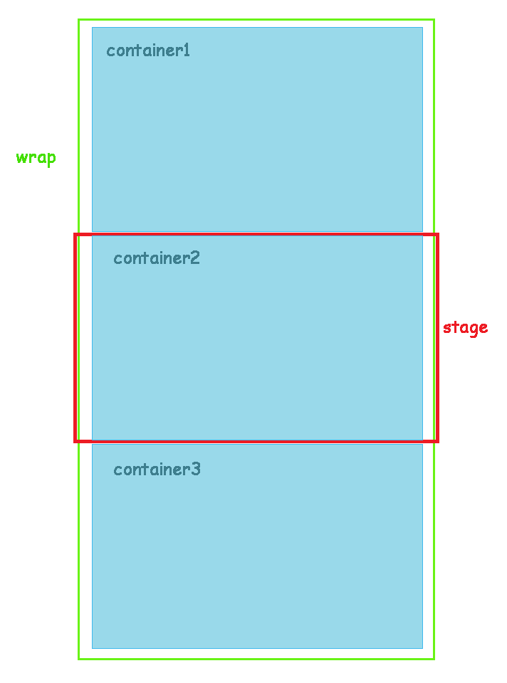

# Perspective.js
Parallax scrolling/hovering effect. And more.

[Demo](http://leopoldthecoder.github.io/Demos/Perspective.js)
## Features
A standalone Javascript library to make dashing scrolling/hovering effects. Inspired by awesome parallax scrolling websites, but can do much more than that. Any CSS properties with number values are supported.
## Installation
Just include `perspective.min.js` in your HTML file:
```html
<script type="text/javascript" src="/path/to/perspective.min.js"></script>
```
## Perspective.scroll Usage
### How it works
Tell Perspective.scroll the initial and final CSS stats of the element you want to add scrolling effects on, and how many scrolls the effects will last. It calculates corresponding CSS values of each scroll based on scroll number of that element.

So any CSS property that uses number as its value is supported, such as `height`, `top`, `transform`, `opacity` and `color`. For color values, hexadecimal notation, RGB(a) notation and HSL notation are all supported.
### HTML structure

As shown above, your HTML should look something like this:
```html
<div class="stage" data-perspective="scroll">
	<div class="wrap">
		<div class="container">...</div>
		<div class="container">...</div>
		...
		<div class="container">...</div>
	</div>
</div>
```
Add `data-perspective="scroll"` property to `.stage` tag. This tells Perspective.scroll to perform scrolling effect on this stage.

There are two properties you can add to `.container` tag:
```html
<div class="container" data-scroll-tag="container name" data-scroll-number=5>...</div>
```
`data-scroll-tag` is used to generate a control panel with which you can go through each container. The value of `data-scroll-tag` shows what this container is about. `data-scroll-number` tells Perspective.scroll how many scrolls the effects will last.
### Javascript function call
For each `.container` element, a two dimensional array should be passed to Perspective.scroll:
```javascript
var cssArr_1 = [[CSS stats of child element 1], ..., [CSS stats of child element n]],
	...,
	cssArr_n = [[CSS stats of child element 1], ..., [CSS stats of child element m]];
perspective.scroll(cssArr_1, ..., cssArr_n);
```
Perspective.scroll applies each inner array to the first `n` child elements of `.container` element.
The inner array consists of a CSS property name, initial and final value of that property:
```javascript
["CSS property", "initial value", "final value"]
```
The corresponding child element changes from initial value to final value of the given CSS property as you scroll. Note that:
* For CSS property, use camel case notation, like you would always do in Javascript.
* For initial value, don't leave out `px` after number `0`.
* For final value, just write the number part of the value(you CAN write the full value, but you don't have to).

An array could be:
```javascript
["marginTop", "0px", "100"]
```
or
```javascript
["transform", "translateY(20px)", "200"]
```
The first array tells Perspective.scroll to scroll the `margin-top` property from `0` all the way to `100px`, and the second scrolls `transform` from `translateY(20px)` to `translateY(200px)`.

If more than one CSS property need to be changed, just push them into the same array:
```javascript
["CSS property 1", "initial value 1", "final value 1", ..., "CSS property n", "initial value n", "final value n"]
```

Perspective.scroll accepts another parameter which is also an array. Its elements are `transition` values(in second) of each `.container` element:
```javascript
perspective.scroll(cssArr_1, ..., cssArr_n, [transition value 1, ..., transition value m]);
```
This array is optional. All `.container` elements have a default `0.2s` for `transtion` property.
## Perspective.hover Usage
Perspective.hover is fairly easy to use compared to Perspective.scroll.
### HTML structure
```html
<div data-perspective="hover">
	<div data-hover-speed=0.04>...</div>
	<div data-hover-speed=0.4>...</div>
</div>
```
Simply add `data-perspective="hover"` to the parent element and all its child element will have a parallax hover effect.

`data-hover-speed` tells Perspective.hover how fast the element moves as you hover on it. This property is optional, and its default value is `0.2`.
### Javascript function call
```javascript
perspective.hover(isHoming);
```
Optional `isHoming` decided if elements go back to where they originally were when your mouse move out of them. Its default value is `true`.
## Example
HTML:
```html
<div class="stage" data-perspective="scroll">
	<div class="wrap">
		<div class="container" id="container1" data-scroll-tag="Top and Opacity" data-scroll-number=20>
			<div class="div1"></div>
			<p>Stay Still</p>
		</div>
		<div class="container" id="container2" data-scroll-tag="Background Image" data-scroll-number=4>
			<div></div>
		</div>
		<div class="container" id="container3" data-scroll-tag="Parallax Hover" data-scroll-number=0 data-perspective="hover">
			<div data-hover-speed=0.02></div>
			<div></div>
		</div>
	</div>
</div>
```
Effects we want:
* `#container1` performs a scroll effect of a `transition` of `0`:
 + `div` element changes from `top: 0; opacity: 1.0;` to `top: 100px; opactiy: 0.3;` through 20 scrolls;
 + `p` element stays still;
* `#container2` performs a scroll effect of a `transition` of `0.5s`:
 + `div` element changes from `background-image: url(bg_1.jpg);` to `background-image: url(bg_5.jpg);` through 4 scrolls;
* `#container3` performs a parallax hover effect:
 + the first `div` element moves with a speed of `0.02`;
 + the second `div` element moves with a speed of `0.2`.

For `#container1`, since `p` element stays still, `cssArr_1` should have only one element:
```javascript
var cssArr_1 = [["top", "0px", "100", "opacity", "1.0", "0.3"]];
```

For `#container2`:
```javascript
var cssArr_2 = [["backgroundImage", "url(bg_1.jpg)", "5"]];
```
Note that we used underline `_` between `bg` and `1` instead of hyphen`-`. This is because `-` will be parsed to minus rather than hyphen.

For `#container3`, we have added `data-perspective="hover"` in parent element and `data-hover-speed=0.02` in the first `div`. Since the second `div` uses the default speed of `0.2`, we don't need to add anything. However, `#container3` is a child element of `.wrap`, which means it is also a part of scroll effect. As a result, an empty array has to be passed to perspective.scroll as a placeholder. Besides, `data-scroll-number=0` and `data-scroll-tag="Parallax Hover"` are needed. If you are performing parallax hover effect on a standalone element, you don't have to do any of the above.

The complete function call is:
```javascript
var cssArr_1 = [["top", "0px", "100", "opacity", "1.0", "0.3"]],
	cssArr_2 = [["backgroundImage", "url(bg_1.jpg)", "5"]];
	cssArr_3 = [];
perspective.scroll(cssArr1, cssArr2, cssArr3, [0, 0.5, 0]);
perspective.hover();
```
## Notice
All class names used above are not mandatory. Use whatever class names you like.
## Version updates
### 1.0.1
Fixed a bug concerning CSS value increment in RGB noted properties.
### 1.0.0
Officially released.
### 0.9.2
Fixed a bug concerning container switching effect.
### 0.9.1
Fixed some bugs. Now the control panel works more reasonably.
### 0.9.0
Function structure updated. Instead of passing multiple parameters to perspective.scroll/perspective.hover, now these two functions will look for `div` nodes with `data-perspective` attribute:
```html
<div class="stage" data-perspective="scroll">
```
or
```html
<div class="stage" data-perspective="hover">
```
1.0.0 release is coming soon.
### 0.0.5
A control panel will be automatically generated to the left edge of the stage. You can now go through each section with ease.
### 0.0.4
Firefox supported. 
### 0.0.3
Comments added.
### 0.0.2
Colors in hex values supported. They will be converted to RGB values.
### 0.0.1
Core functionalities accomplished. You can generate a parallax scrolling/hovering page by passing some parameters to perspective.scroll/perspective.hover after including Perspective.js in your HTML.
## License
The MIT License (MIT)

Copyright (c) 2015 Yang Yi

Permission is hereby granted, free of charge, to any person obtaining a copy
of this software and associated documentation files (the "Software"), to deal
in the Software without restriction, including without limitation the rights
to use, copy, modify, merge, publish, distribute, sublicense, and/or sell
copies of the Software, and to permit persons to whom the Software is
furnished to do so, subject to the following conditions:

The above copyright notice and this permission notice shall be included in all
copies or substantial portions of the Software.

THE SOFTWARE IS PROVIDED "AS IS", WITHOUT WARRANTY OF ANY KIND, EXPRESS OR
IMPLIED, INCLUDING BUT NOT LIMITED TO THE WARRANTIES OF MERCHANTABILITY,
FITNESS FOR A PARTICULAR PURPOSE AND NONINFRINGEMENT. IN NO EVENT SHALL THE
AUTHORS OR COPYRIGHT HOLDERS BE LIABLE FOR ANY CLAIM, DAMAGES OR OTHER
LIABILITY, WHETHER IN AN ACTION OF CONTRACT, TORT OR OTHERWISE, ARISING FROM,
OUT OF OR IN CONNECTION WITH THE SOFTWARE OR THE USE OR OTHER DEALINGS IN THE
SOFTWARE.
